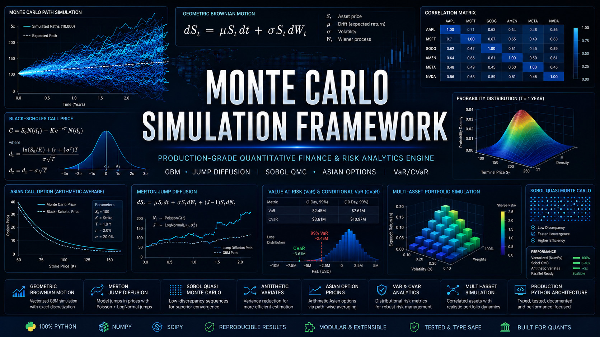
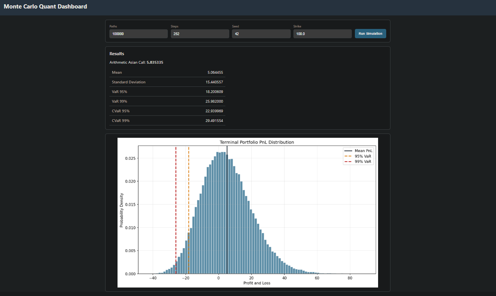
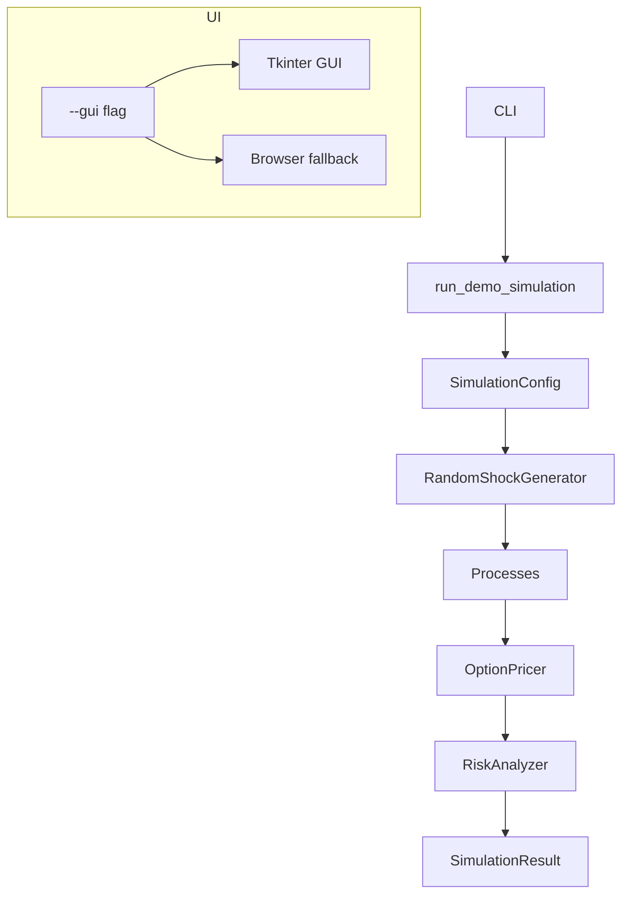

# Quant Monte Carlo Simulation Framework



*Infographic caption:* show **stochastic paths**, a **distribution histogram**, **option pricing outputs**, **risk metric thresholds (VaR/CVaR)**, and the **GUI workflow** (*CLI → Tkinter → browser fallback*).

[](https://www.python.org/)
[](https://numpy.org/)
[](https://scipy.org/)
[](https://matplotlib.org/)
[](https://en.wikipedia.org/wiki/Monte_Carlo_method)
[](LICENSE)

## Simulation Output Preview



*Demonstrates* deterministic console summary of option pricing and **portfolio risk metrics** computed from the simulated terminal PnL distribution.


*Demonstrates* the terminal **PnL histogram** annotated with **Mean**, **VaR 95%**, and **VaR 99%** thresholds.


*Demonstrates* interactive controls for `paths`, `steps`, `seed`, and `strike`, plus real-time rendering of the distribution plot and metrics.

---

## Table of Contents

- [Project Overview](#project-overview)
- [Key Features](#key-features)
- [Mathematical Background](#mathematical-background)
  - [Geometric Brownian Motion (GBM)](#geometric-brownian-motion-gbm)
  - [Merton Jump-Diffusion](#merton-jump-diffusion)
  - [Multi-asset Correlated GBM](#multi-asset-correlated-gbm)
  - [Sobol Quasi-Monte Carlo](#sobol-quasi-monte-carlo)
  - [Antithetic Variates](#antithetic-variates)
  - [European and Arithmetic Asian Payoffs](#european-and-arithmetic-asian-payoffs)
  - [VaR and CVaR / Expected Shortfall](#var-and-cvar--expected-shortfall)
- [Architecture](#architecture)
  - [Mermaid Architecture Diagram](#mermaid-architecture-diagram)
- [Repository Structure](#repository-structure)
- [Installation](#installation)
- [Quick Start](#quick-start)
- [GUI Usage](#gui-usage)
- [Usage Examples](#usage-examples)
  - [Single-asset GBM simulation](#single-asset-gbm-simulation)
  - [Merton Jump-Diffusion simulation](#merton-jump-diffusion-simulation)
  - [3-asset correlated GBM simulation](#3-asset-correlated-gbm-simulation)
  - [European call pricing](#european-call-pricing)
  - [Arithmetic Asian call pricing](#arithmetic-asian-call-pricing)
  - [Portfolio PnL risk analysis](#portfolio-pnl-risk-analysis)
  - [Saving a distribution graph](#saving-a-distribution-graph)
- [CLI Reference](#cli-reference)
- [Output Interpretation](#output-interpretation)
- [Performance and Memory Notes](#performance-and-memory-notes)
- [Extending the Framework](#extending-the-framework)
- [Testing and Validation Strategy](#testing-and-validation-strategy)
- [Limitations and Assumptions](#limitations-and-assumptions)
- [Roadmap](#roadmap)
- [Contribution Guidelines](#contribution-guidelines)
- [License and Disclaimer](#license-and-disclaimer)

---

## Project Overview

This project provides a **production-oriented, production-reviewable Python Monte Carlo simulation framework for quantitative finance**.

It supports:

- **Vectorized** Monte Carlo simulation paths in NumPy
- **Geometric Brownian Motion (GBM)**
- **Merton Jump-Diffusion**
- **Multi-asset correlated GBM** driven by correlated Brownian shocks via **Cholesky decomposition**
- **PRNG** and **Sobol quasi-Monte Carlo** sampling (Scrambled Sobol via `scipy.stats.qmc`)
- **Antithetic variates** for variance reduction
- **European option pricing** and **arithmetic Asian option pricing**
- **Portfolio risk metrics** from terminal PnL distributions:
  - Mean, Standard Deviation
  - VaR 95% / VaR 99%
  - CVaR 95% / CVaR 99% (Expected Shortfall)
- Distribution **histogram generation**
- **Tkinter GUI** (when available)
- **Browser-based GUI fallback** (standard library HTTP server) when Tkinter is not installed

### Why Monte Carlo matters in quant finance

Many realistic derivatives and risk problems lack closed-form solutions:

- path dependence (e.g., **Asian options**)
- discontinuities / jumps (e.g., **Merton**)
- multi-asset correlation (risk aggregation and joint dynamics)
- tail-risk estimation (VaR / CVaR)

Monte Carlo provides a general-purpose estimation engine that can be validated through convergence, sanity checks, and distributional diagnostics.

### Production-oriented design goals

> This framework is built to be *engineering-review friendly*: deterministic seeding, explicit configuration, consistent tensor shapes, vectorized computations, and clear interfaces between simulation, pricing, risk, plotting, and UI.

---

## Key Features

- **Vectorized NumPy implementation**
  - Simulations operate on full tensors of shape `(n_paths, n_steps + 1, ...)`.
  - Avoids Python-level loops for performance and reproducibility.

- **Abstract `StochasticProcess` base class**
  - Enforces a consistent `simulate()` contract.

- **Reproducible seed management**
  - Uses `numpy.random.default_rng(seed)` for PRNG.
  - Uses scrambled Sobol with deterministic `seed`.

- **PRNG sampling**
  - Gaussian shocks via `rng.standard_normal`.

- **Sobol quasi-Monte Carlo sampling**
  - Uses `scipy.stats.qmc.Sobol(..., scramble=True)`.
  - Transforms uniforms to normals using inverse CDF (`scipy.stats.norm.ppf`).

- **Antithetic variates**
  - Pairs Gaussian shocks `Z` and `-Z`.
  - Implemented at the shock generation layer for reuse across processes.

- **GBM**
  - Exact log-Euler discretization using cumulative log increments.

- **Merton Jump-Diffusion**
  - Poisson jump arrivals with normally distributed log jump sizes.
  - Includes a jump compensator term for drift adjustment.

- **Multi-asset correlated GBM using Cholesky decomposition**
  - Correlated Brownian drivers produced from an instantaneous covariance matrix.

- **European option pricing**
  - Terminal-price payoff from simulated paths with discounting.

- **Arithmetic Asian option pricing**
  - Path-average payoff from simulated trajectories.

- **Portfolio risk metrics extraction**
  - Mean, Std Dev, VaR 95% / 99%, CVaR 95% / 99% from terminal PnL.

- **Distribution graph generation**
  - Matplotlib histogram with annotated mean and tail thresholds.

- **Tkinter GUI**
  - Parameter inputs and in-window plot rendering.

- **Browser GUI fallback**
  - Launches a local webpage at `http://127.0.0.1:8050` using only the Python standard library.

---

# Mathematical Background

### Geometric Brownian Motion (GBM)

GBM under drift:

$$
\frac{dS_t}{S_t} = \mu dt + \sigma dW_t
$$

Using discrete-time simulation with **log-Euler** (exact in the log-normal sense for GBM), the increment is:

$$
\Delta \ln S =
\left(\mu - \frac{1}{2}\sigma^2\right)\Delta t
+
\sigma\sqrt{\Delta t}Z
$$

where

$$
Z \sim \mathcal{N}(0,1)
$$

Paths are built via cumulative sums in log space and exponentiation back to price space.

### Merton Jump-Diffusion

Merton's model adds compound Poisson jumps to GBM:

$$
\frac{dS_t}{S_t}
=
(\mu-\lambda\kappa)dt
+
\sigma dW_t
+
(J-1)dN_t
$$

with:

**Jump arrivals**

$$
N \sim \text{Poisson}(\lambda \Delta t)
$$

**Jump sizes**

$$
\ln J \sim \mathcal{N}(m,v^2)
$$

**Compensator**

$$
\kappa
=
\mathbb{E}[J-1]
=
\exp\left(m+\frac{1}{2}v^2\right)-1
$$

The implementation samples Poisson jump counts and Gaussian shocks for both diffusion and jumps, constructing compensated drift and vectorized log increments.

### Multi-Asset GBM

For $n$ correlated assets:

$$
\frac{dS_i(t)}{S_i(t)}
=
\mu_i dt
+
\sigma_i dW_i(t)
$$

with instantaneous Brownian covariance:

$$
\text{Cov}(dW_i,dW_j)
=
\rho_{ij}dt
$$

Let $\Sigma$ denote an instantaneous return covariance matrix.

$$
\Sigma = LL^\top
$$

Correlated standard-normal drivers are generated as:

$$
\mathbf{Z}_{corr}
=
\mathbf{Z}_{ind}L^\top
$$

where

$$
\mathbf{Z}_{ind}
\sim
\mathcal{N}(0,I)
$$

### Sobol Quasi-Monte Carlo

Sobol generates low-discrepancy points:

$$
u \in (0,1)^d
$$

Gaussian variates are obtained via inverse transform:

$$
Z = \Phi^{-1}(u)
$$

This project uses **scrambled Sobol sequences** for better robustness.

### Antithetic Variates

For antithetic sampling, shocks are paired:

$$
Z
\quad \text{and} \quad
-Z
$$

The estimator averages payoffs across each pair, typically reducing variance for monotone payoffs.

### European Option Payoff

**Call**

$$
\max(S_T-K,0)
$$

**Put**

$$
\max(K-S_T,0)
$$

### Arithmetic Asian Option Payoff

Using arithmetic averaging over $M$ observation times:

$$
\bar{S}
=
\frac{1}{M}
\sum_{k=1}^{M}
S_{t_k}
$$

**Call**

$$
\max(\bar{S}-K,0)
$$

**Put**

$$
\max(K-\bar{S},0)
$$

### VaR and CVaR (Expected Shortfall)

Let $\mathrm{PnL}$ be realized profit-and-loss.

$$
\mathrm{Loss}
=
-\mathrm{PnL}
$$

Value at Risk:

$$
\mathrm{VaR}_{\alpha}
=
\mathrm{Quantile}_{\alpha}
(\mathrm{Loss})
$$

Conditional Value at Risk:

$$
\mathrm{CVaR}_{\alpha}
=
\mathbb{E}
\left[
\mathrm{Loss}
\mid
\mathrm{Loss}
\ge
\mathrm{VaR}_{\alpha}
\right]
$$

> **Interpretation Note:** VaR and CVaR are reported as positive loss magnitudes. Depending on your reporting convention, you may wish to flip the sign for downside PnL presentation.

---

## Architecture

All major components are implemented in `outputs/monte_carlo_framework.py` as a compact demonstration framework.

### Class responsibilities

| Class | Responsibility |
|---|---|
| `SimulationConfig` | Shared simulation parameters (paths, steps, maturity, seed, sampling method, antithetic, dtype). |
| `SamplingMethod` | Selects `PRNG` vs `SOBOL`. |
| `OptionType` | `CALL` / `PUT`. |
| `RandomShockGenerator` | Generates reproducible Gaussian shocks (PRNG or Sobol) and Poisson counts for jump models; antithetic pairing handled here. |
| `StochasticProcess` (ABC) | Abstract interface for `simulate()` returning standardized path tensors. |
| `GeometricBrownianMotion` | Single-asset GBM path simulation using exact log-Euler discretization. |
| `MertonJumpDiffusion` | Single-asset Merton jump-diffusion with Poisson jump arrivals and lognormal jumps. |
| `MultiAssetGeometricBrownianMotion` | Correlated multi-asset GBM via Cholesky decomposition of a covariance matrix. |
| `OptionPricer` | Vectorized payoff/pricing for European and arithmetic Asian options, plus portfolio terminal values. |
| `RiskAnalyzer` / `RiskMetrics` | Computes VaR/CVaR and summary statistics from a terminal PnL distribution. |
| `SimulationResult` | Bundles output artifacts (paths, PnL distribution, Asian option price, risk metrics, config). |
| `MonteCarloDashboard` | Tkinter GUI for running the demo and rendering charts inline. |
| Browser dashboard fallback | Standard-library HTTP server rendering HTML with embedded PNG chart output. |

### Mermaid Architecture Diagram

> Note: GitHub Mermaid rendering can be sensitive to node-label characters.
> If Mermaid fails to render in your GitHub UI, the architecture is still documented in the section text.




---

## Repository Structure

Expected structure:

```text
project-root/
├── outputs/
│   ├── monte_carlo_framework.py
│   ├── portfolio_pnl_distribution.png
│   └── smoke_distribution.png
├── assets/
│   ├── header-infographic.png
│   ├── results-console.png
│   ├── pnl-distribution.png
│   └── gui-dashboard.png
└── README.md
```

Note: the demo writes distribution images under `outputs/`.

---

## Installation

### Python version recommendation

- Python **3.10+**

### Dependency list

This project relies on:

- `numpy`
- `scipy`
- `matplotlib`

Tkinter:

- Tkinter is **not installed via pip**. It is provided by the Python distribution/OS.

> Browser fallback requires no extra GUI packages.

### Virtual environment setup

```bash
python -m venv .venv
.venv\Scripts\activate

python -m pip install --upgrade pip
pip install numpy scipy matplotlib
```

---

## Quick Start

### Run the CLI demo (headless)

```bash
python outputs/monte_carlo_framework.py
```

What it does:

- runs `run_demo_simulation()` (3-asset correlated GBM under Sobol QMC + antithetic)
- computes arithmetic Asian call price and portfolio terminal PnL distribution
- saves a distribution histogram plot to the `--plot` output path
- prints a deterministic console summary of option pricing and risk metrics

### Run the demo with GUI

```bash
python outputs/monte_carlo_framework.py --gui
```

- attempts to launch the **Tkinter** dashboard
- if Tkinter is unavailable in the Python environment, it automatically starts the **browser-based GUI fallback**

### Run with explicit paths/steps/strike/seed

```bash
python outputs/monte_carlo_framework.py --paths 100000 --steps 252 --strike 100 --seed 42
```

- `--paths`: number of Monte Carlo paths
- `--steps`: number of discretization steps
- `--strike`: arithmetic Asian strike on the first asset
- `--seed`: deterministic seed controlling PRNG/Sobol scrambling

---

## GUI Usage

### Tkinter GUI behavior

- The **Run Simulation** button triggers `run_demo_simulation(n_paths, n_steps, seed, strike)`.
- The UI displays:
  - Arithmetic Asian Call price
  - risk metrics table values
  - an embedded Matplotlib histogram plot

### Browser fallback behavior

If Tkinter cannot be imported (`ModuleNotFoundError: tkinter`), the program starts an HTTP server.

- Local URL:
  - `http://127.0.0.1:8050`
- The dashboard:
  - allows setting `paths`, `steps`, `seed`, `strike`
  - runs the simulation server-side on `/run`
  - renders metrics and an embedded PNG chart (base64-encoded)

---

## Usage Examples

> The examples below target `outputs/monte_carlo_framework.py` since the repository is packaged as a single self-contained demo module.

### Single-asset GBM simulation

```python
from outputs.monte_carlo_framework import (
    SimulationConfig,
    SamplingMethod,
    GeometricBrownianMotion,
)

config = SimulationConfig(
    n_paths=100_000,
    n_steps=252,
    maturity=1.0,
    seed=123,
    sampling_method=SamplingMethod.SOBOL,
    antithetic=True,
)

process = GeometricBrownianMotion(
    initial_value=100.0,
    mu=0.05,
    sigma=0.20,
    config=config,
)

paths = process.simulate()  # (n_paths, n_steps+1)
```

### Merton Jump-Diffusion simulation

```python
from outputs.monte_carlo_framework import SimulationConfig, SamplingMethod, MertonJumpDiffusion

config = SimulationConfig(
    n_paths=50_000,
    n_steps=252,
    maturity=1.0,
    seed=7,
    sampling_method=SamplingMethod.PRNG,
    antithetic=False,
)

process = MertonJumpDiffusion(
    initial_value=100.0,
    mu=0.03,
    sigma=0.18,
    jump_intensity=0.7,
    jump_mean=-0.02,
    jump_vol=0.12,
    config=config,
)

paths = process.simulate()  # (n_paths, n_steps+1)
```

### 3-asset correlated GBM simulation

```python
import numpy as np
from outputs.monte_carlo_framework import SimulationConfig, SamplingMethod, MultiAssetGeometricBrownianMotion

config = SimulationConfig(
    n_paths=100_000,
    n_steps=252,
    maturity=1.0,
    seed=42,
    sampling_method=SamplingMethod.SOBOL,
    antithetic=True,
)

spots = np.array([100.0, 95.0, 105.0])
mu = np.array([0.05, 0.045, 0.055])
vol = np.array([0.20, 0.18, 0.22])
correlation = np.array(
    [
        [1.00, 0.35, 0.20],
        [0.35, 1.00, 0.40],
        [0.20, 0.40, 1.00],
    ]
)

covariance = np.outer(vol, vol) * correlation

process = MultiAssetGeometricBrownianMotion(
    initial_values=spots,
    mu=mu,
    covariance_matrix=covariance,
    config=config,
)

paths = process.simulate()  # (n_paths, n_steps+1, n_assets)
```

### European call pricing

```python
from outputs.monte_carlo_framework import OptionPricer, OptionType

pricer = OptionPricer(risk_free_rate=0.04)

price = pricer.european_option(
    paths=paths,          # can be 2D or 3D
    strike=100.0,
    maturity=1.0,
    option_type=OptionType.CALL,
    asset_index=0,
)

print(price)
```

### Arithmetic Asian call pricing

```python
from outputs.monte_carlo_framework import OptionPricer, OptionType

pricer = OptionPricer(risk_free_rate=0.04)

asian_call_price = pricer.arithmetic_asian_option(
    paths=paths,
    strike=100.0,
    maturity=1.0,
    option_type=OptionType.CALL,
    asset_index=0,
    include_initial=False,
)

print(asian_call_price)
```

### Portfolio PnL risk analysis

```python
import numpy as np
from outputs.monte_carlo_framework import OptionPricer, RiskAnalyzer

weights = np.array([0.40, 0.35, 0.25])
initial_portfolio_value = float(spots @ weights)
terminal_portfolio_value = OptionPricer.portfolio_terminal_values(paths, weights)

pnl = terminal_portfolio_value - initial_portfolio_value
metrics = RiskAnalyzer.summarize(pnl)

print(metrics.as_dict())
```

### Saving a distribution graph

```python
from pathlib import Path
from outputs.monte_carlo_framework import save_distribution_graph

out = save_distribution_graph(
    portfolio_pnl=pnl,
    metrics=metrics,
    output_path=Path("outputs/pnl-distribution.png"),
)

