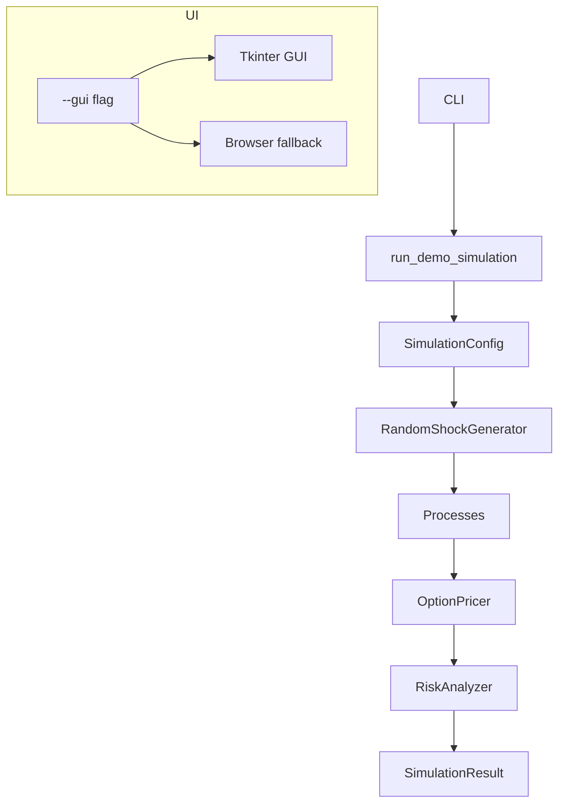

# Quant Monte Carlo Simulation Framework


*Infographic caption:* show **stochastic paths**, a **distribution histogram**, **option pricing outputs**, **risk metric thresholds (VaR/CVaR)**, and the **GUI workflow** (*CLI → Tkinter → browser fallback*).

[](https://www.python.org/)
[](https://numpy.org/)
[](https://scipy.org/)
[](https://matplotlib.org/)
[](https://en.wikipedia.org/wiki/Monte_Carlo_method)
[](LICENSE)

## Simulation Output Preview


*Demonstrates* deterministic console summary of option pricing and **portfolio risk metrics** computed from the simulated terminal PnL distribution.


*Demonstrates* the terminal **PnL histogram** annotated with **Mean**, **VaR 95%**, and **VaR 99%** thresholds.


*Demonstrates* interactive controls for `paths`, `steps`, `seed`, and `strike`, plus real-time rendering of the distribution plot and metrics.

---

# 📚 Documentation Index

| Category | Section |
|-----------|----------|
| 📖 Overview | [Project Overview](#project-overview) |
| ✨ Features | [Key Features](#key-features) |
| 📐 Theory | [Mathematical Background](#mathematical-background) |
| 🏗️ Design | [Architecture](#architecture) |
| 📂 Structure | [Repository Structure](#repository-structure) |
| ⚙️ Setup | [Installation](#installation) |
| 🚀 Getting Started | [Quick Start](#quick-start) |
| 🖥️ Interface | [GUI Usage](#gui-usage) |
| 💡 Examples | [Usage Examples](#usage-examples) |
| ⌨️ Commands | [CLI Reference](#cli-reference) |
| 📊 Analytics | [Output Interpretation](#output-interpretation) |
| ⚡ Performance | [Performance and Memory Notes](#performance-and-memory-notes) |
| 🔧 Customization | [Extending the Framework](#extending-the-framework) |
| 🧪 Validation | [Testing and Validation Strategy](#testing-and-validation-strategy) |
| ⚠️ Constraints | [Limitations and Assumptions](#limitations-and-assumptions) |
| 🛣️ Future Work | [Roadmap](#roadmap) |
| 🤝 Community | [Contribution Guidelines](#contribution-guidelines) |
| 📜 Legal | [License and Disclaimer](#license-and-disclaimer) |

---

## 📐 Mathematical Background

| Model / Concept | Link |
|-----------------|------|
| Geometric Brownian Motion (GBM) | [Jump](#geometric-brownian-motion-gbm) |
| Merton Jump-Diffusion | [Jump](#merton-jump-diffusion) |
| Multi-Asset Correlated GBM | [Jump](#multi-asset-correlated-gbm) |
| Sobol Quasi-Monte Carlo | [Jump](#sobol-quasi-monte-carlo) |
| Antithetic Variates | [Jump](#antithetic-variates) |
| European and Arithmetic Asian Payoffs | [Jump](#european-and-arithmetic-asian-payoffs) |
| VaR and CVaR / Expected Shortfall | [Jump](#var-and-cvar--expected-shortfall) |

---

## 💡 Usage Examples

| Example | Link |
|----------|------|
| Single-asset GBM simulation | [Jump](#single-asset-gbm-simulation) |
| Merton Jump-Diffusion simulation | [Jump](#merton-jump-diffusion-simulation) |
| 3-asset correlated GBM simulation | [Jump](#3-asset-correlated-gbm-simulation) |
| European call pricing | [Jump](#european-call-pricing) |
| Arithmetic Asian call pricing | [Jump](#arithmetic-asian-call-pricing) |
| Portfolio PnL risk analysis | [Jump](#portfolio-pnl-risk-analysis) |
| Saving a distribution graph | [Jump](#saving-a-distribution-graph) |

---


## Project Overview

This project provides a **production-oriented Monte Carlo simulation framework for quantitative finance**, designed to be both research-grade and engineering-reviewable.

The framework combines modern quantitative finance models, risk analytics, variance-reduction techniques, and visualization capabilities within a unified and extensible architecture.

### Core Capabilities

- **Vectorized Monte Carlo simulations** implemented in NumPy
- **Geometric Brownian Motion (GBM)**
- **Merton Jump-Diffusion**
- **Multi-Asset Correlated GBM** using Cholesky-based correlation structures
- **Pseudo-Random (PRNG)** and **Sobol Quasi-Monte Carlo** sampling
- **Antithetic Variates** for variance reduction
- **European Option Pricing**
- **Arithmetic Asian Option Pricing**
- **Portfolio Risk Analytics**
  - Mean
  - Standard Deviation
  - VaR (95%, 99%)
  - CVaR / Expected Shortfall (95%, 99%)
- **Distribution Histogram Generation**
- **Tkinter Desktop GUI**
- **Browser-Based GUI Fallback** using the Python standard library

### Why Monte Carlo Matters in Quantitative Finance

Many realistic derivatives-pricing and risk-management problems do not admit closed-form analytical solutions. Examples include:

- **Path-dependent derivatives** (e.g., Asian options)
- **Jump processes and discontinuous dynamics** (e.g., Merton Jump-Diffusion)
- **Multi-asset correlation structures**
- **Portfolio-level risk aggregation**
- **Tail-risk estimation** through VaR and CVaR

Monte Carlo simulation provides a flexible numerical framework capable of modeling these complexities while supporting convergence analysis, validation procedures, and distributional diagnostics.

### Engineering Design Principles

This framework is designed with a strong emphasis on:

- Deterministic seeding and reproducibility
- Explicit configuration and parameter management
- Consistent tensor and array structures
- Fully vectorized numerical computation
- Modular separation of simulation, pricing, risk analytics, visualization, and UI layers
- Production-reviewable architecture suitable for quantitative research and software engineering workflows

---

## Key Features

### Simulation Engine

- Fully **vectorized NumPy implementation**
- Simulations operate on tensors of shape:

```text
(n_paths, n_steps + 1, ...)
```

- Minimizes Python-level loops for improved performance and reproducibility

### Stochastic Process Framework

- Abstract `StochasticProcess` base class
- Consistent `simulate()` interface across all models
- Extensible architecture for custom stochastic processes

### Random Number Generation

#### Reproducible Seed Management

- Uses `numpy.random.default_rng(seed)`
- Supports deterministic simulation workflows
- Reproducible Sobol sequence generation through fixed seeds

#### Pseudo-Random Sampling (PRNG)

- Gaussian shocks generated via:

```python
rng.standard_normal(...)
```

#### Sobol Quasi-Monte Carlo Sampling

- Uses:

```python
scipy.stats.qmc.Sobol(..., scramble=True)
```

- Uniform samples transformed to Gaussian variates through:

```python
scipy.stats.norm.ppf(...)
```

### Variance Reduction

#### Antithetic Variates

- Generates paired shocks:

```text
Z and -Z
```

- Reduces estimator variance
- Implemented at the shock-generation layer for reuse across all simulation models

### Supported Stochastic Models

#### Geometric Brownian Motion (GBM)

- Exact log-Euler discretization
- Vectorized cumulative log-return construction
- Efficient path generation in log space

#### Merton Jump-Diffusion

- Poisson jump arrivals
- Normally distributed log jump sizes
- Drift-compensated jump process
- Fully vectorized implementation

#### Multi-Asset Correlated GBM

- Cholesky-based correlation modeling
- Correlated Brownian drivers generated from covariance matrices
- Supports portfolio-level simulation workflows

### Derivative Pricing

#### European Options

- Terminal payoff pricing
- Discounted Monte Carlo valuation

#### Arithmetic Asian Options

- Path-average payoff calculation
- Monte Carlo valuation of path-dependent derivatives

### Risk Analytics

Portfolio risk metrics derived from terminal PnL distributions:

- Mean
- Standard Deviation
- VaR 95%
- VaR 99%
- CVaR 95%
- CVaR 99%

### Visualization

- Distribution histogram generation
- Mean annotation
- VaR and CVaR threshold markers
- Publication-quality plotting using Matplotlib

### User Interfaces

#### Tkinter GUI

- Interactive parameter inputs
- In-window chart rendering
- Desktop application workflow

#### Browser-Based GUI Fallback

- Automatic fallback when Tkinter is unavailable
- Local web interface served via:

```text
http://127.0.0.1:8050
```

- Implemented entirely with the Python standard library

---

## Mathematical Background

### Geometric Brownian Motion (GBM)

GBM under drift:

```text
dS/S = μdt + σdW
```

Using discrete-time simulation with **log-Euler** (exact in the log-normal sense for GBM), the increment is:

```text
Δln(S) = (μ − 0.5σ²)Δt + σ√Δt · Z
```

where:

```text
Z ~ N(0,1)
```

Paths are built via cumulative sums in log space and exponentiation back to price space.

### Merton Jump-Diffusion

Merton's model adds compound Poisson jumps to GBM:

```text
dS/S = (μ − λκ)dt + σdW + (J − 1)dN
```

with:

**Jump arrivals**

```text
N ~ Poisson(λΔt)
```

**Jump sizes**

```text
ln(J) ~ N(m, v²)
```

**Compensator**

```text
κ = E[J − 1] = exp(m + 0.5v²) − 1
```

The implementation samples Poisson jump counts and Gaussian shocks for both diffusion and jumps, constructing compensated drift and vectorized log increments.

### Multi-Asset GBM

For n correlated assets:

```text
dSi/Si = μi dt + σi dWi
```

with instantaneous Brownian covariance:

```text
Cov(dWi, dWj) = ρij dt
```

Let Σ denote an instantaneous return covariance matrix.

```text
Σ = LLᵀ
```

Correlated standard-normal drivers are generated as:

```text
Zcorr = Zind Lᵀ
```

where:

```text
Zind ~ N(0, I)
```

### Sobol Quasi-Monte Carlo

Sobol generates low-discrepancy points:

```text
u ∈ (0,1)^d
```

Gaussian variates are obtained via inverse transform:

```text
Z = Φ⁻¹(u)
```

This project uses **scrambled Sobol sequences** for better robustness.

### Antithetic Variates

For antithetic sampling, shocks are paired:

```text
Z and −Z
```

The estimator averages payoffs across each pair, typically reducing variance for monotone payoffs.

### European Option Payoff

**Call**

```text
max(ST − K, 0)
```

**Put**

```text
max(K − ST, 0)
```

### Arithmetic Asian Option Payoff

Using arithmetic averaging over M observation times:

```text
S̄ = (1/M) Σ S(tk)
```

**Call**

```text
max(S̄ − K, 0)
```

**Put**

```text
max(K − S̄, 0)
```

### VaR and CVaR (Expected Shortfall)

Let PnL be realized profit-and-loss.

```text
Loss = −PnL
```

Value at Risk:

```text
VaRα = Quantileα(Loss)
```

Conditional Value at Risk:

```text
CVaRα = E[Loss | Loss ≥ VaRα]
```

> **Interpretation Note:** VaR and CVaR are reported as positive loss magnitudes. Depending on your reporting convention, you may wish to flip the sign for downside PnL presentation.

---

## Architecture

All major components are implemented in `outputs/monte_carlo_framework.py` as a compact demonstration framework.

### Class responsibilities

| Class | Responsibility |
|---|---|
| `SimulationConfig` | Shared simulation parameters (paths, steps, maturity, seed, sampling method, antithetic, dtype). |
| `SamplingMethod` | Selects `PRNG` vs `SOBOL`. |
| `OptionType` | `CALL` / `PUT`. |
| `RandomShockGenerator` | Generates reproducible Gaussian shocks (PRNG or Sobol) and Poisson counts for jump models; antithetic pairing handled here. |
| `StochasticProcess` (ABC) | Abstract interface for `simulate()` returning standardized path tensors. |
| `GeometricBrownianMotion` | Single-asset GBM path simulation using exact log-Euler discretization. |
| `MertonJumpDiffusion` | Single-asset Merton jump-diffusion with Poisson jump arrivals and lognormal jumps. |
| `MultiAssetGeometricBrownianMotion` | Correlated multi-asset GBM via Cholesky decomposition of a covariance matrix. |
| `OptionPricer` | Vectorized payoff/pricing for European and arithmetic Asian options, plus portfolio terminal values. |
| `RiskAnalyzer` / `RiskMetrics` | Computes VaR/CVaR and summary statistics from a terminal PnL distribution. |
| `SimulationResult` | Bundles output artifacts (paths, PnL distribution, Asian option price, risk metrics, config). |
| `MonteCarloDashboard` | Tkinter GUI for running the demo and rendering charts inline. |
| Browser dashboard fallback | Standard-library HTTP server rendering HTML with embedded PNG chart output. |

### Mermaid Architecture Diagram

> Note: GitHub Mermaid rendering can be sensitive to node-label characters.
> If Mermaid fails to render in your GitHub UI, the architecture is still documented in the section text.




---

## Repository Structure

Expected structure:

```text
project-root/
├── outputs/
│   ├── monte_carlo_framework.py
│   ├── portfolio_pnl_distribution.png
│   └── smoke_distribution.png
├── assets/
│   ├── header-infographic.png
│   ├── results-console.png
│   ├── pnl-distribution.png
│   └── gui-dashboard.png
└── README.md
```

Note: the demo writes distribution images under `outputs/`.

---

## Installation

### Python version recommendation

- Python **3.10+**

### Dependency list

This project relies on:

- `numpy`
- `scipy`
- `matplotlib`

Tkinter:

- Tkinter is **not installed via pip**. It is provided by the Python distribution/OS.

> Browser fallback requires no extra GUI packages.

### Virtual environment setup

```bash
python -m venv .venv
.venv\Scripts\activate

python -m pip install --upgrade pip
pip install numpy scipy matplotlib
```

---

## Quick Start

### Run the CLI demo (headless)

```bash
python outputs/monte_carlo_framework.py
```

What it does:

- runs `run_demo_simulation()` (3-asset correlated GBM under Sobol QMC + antithetic)
- computes arithmetic Asian call price and portfolio terminal PnL distribution
- saves a distribution histogram plot to the `--plot` output path
- prints a deterministic console summary of option pricing and risk metrics

### Run the demo with GUI

```bash
python outputs/monte_carlo_framework.py --gui
```

- attempts to launch the **Tkinter** dashboard
- if Tkinter is unavailable in the Python environment, it automatically starts the **browser-based GUI fallback**

### Run with explicit paths/steps/strike/seed

```bash
python outputs/monte_carlo_framework.py --paths 100000 --steps 252 --strike 100 --seed 42
```

- `--paths`: number of Monte Carlo paths
- `--steps`: number of discretization steps
- `--strike`: arithmetic Asian strike on the first asset
- `--seed`: deterministic seed controlling PRNG/Sobol scrambling

---

## GUI Usage

### Tkinter GUI behavior

- The **Run Simulation** button triggers `run_demo_simulation(n_paths, n_steps, seed, strike)`.
- The UI displays:
  - Arithmetic Asian Call price
  - risk metrics table values
  - an embedded Matplotlib histogram plot

### Browser fallback behavior

If Tkinter cannot be imported (`ModuleNotFoundError: tkinter`), the program starts an HTTP server.

- Local URL:
  - `http://127.0.0.1:8050`
- The dashboard:
  - allows setting `paths`, `steps`, `seed`, `strike`
  - runs the simulation server-side on `/run`
  - renders metrics and an embedded PNG chart (base64-encoded)

---

## Usage Examples

> The examples below target `outputs/monte_carlo_framework.py` since the repository is packaged as a single self-contained demo module.

### Single-asset GBM simulation

```python
from outputs.monte_carlo_framework import (
    SimulationConfig,
    SamplingMethod,
    GeometricBrownianMotion,
)

config = SimulationConfig(
    n_paths=100_000,
    n_steps=252,
    maturity=1.0,
    seed=123,
    sampling_method=SamplingMethod.SOBOL,
    antithetic=True,
)

process = GeometricBrownianMotion(
    initial_value=100.0,
    mu=0.05,
    sigma=0.20,
    config=config,
)

paths = process.simulate()  # (n_paths, n_steps+1)
```

### Merton Jump-Diffusion simulation

```python
from outputs.monte_carlo_framework import SimulationConfig, SamplingMethod, MertonJumpDiffusion

config = SimulationConfig(
    n_paths=50_000,
    n_steps=252,
    maturity=1.0,
    seed=7,
    sampling_method=SamplingMethod.PRNG,
    antithetic=False,
)

process = MertonJumpDiffusion(
    initial_value=100.0,
    mu=0.03,
    sigma=0.18,
    jump_intensity=0.7,
    jump_mean=-0.02,
    jump_vol=0.12,
    config=config,
)

paths = process.simulate()  # (n_paths, n_steps+1)
```

### 3-asset correlated GBM simulation

```python
import numpy as np
from outputs.monte_carlo_framework import SimulationConfig, SamplingMethod, MultiAssetGeometricBrownianMotion

config = SimulationConfig(
    n_paths=100_000,
    n_steps=252,
    maturity=1.0,
    seed=42,
    sampling_method=SamplingMethod.SOBOL,
    antithetic=True,
)

spots = np.array([100.0, 95.0, 105.0])
mu = np.array([0.05, 0.045, 0.055])
vol = np.array([0.20, 0.18, 0.22])
correlation = np.array(
    [
        [1.00, 0.35, 0.20],
        [0.35, 1.00, 0.40],
        [0.20, 0.40, 1.00],
    ]
)

covariance = np.outer(vol, vol) * correlation

process = MultiAssetGeometricBrownianMotion(
    initial_values=spots,
    mu=mu,
    covariance_matrix=covariance,
    config=config,
)

paths = process.simulate()  # (n_paths, n_steps+1, n_assets)
```

### European call pricing

```python
from outputs.monte_carlo_framework import OptionPricer, OptionType

pricer = OptionPricer(risk_free_rate=0.04)

price = pricer.european_option(
    paths=paths,          # can be 2D or 3D
    strike=100.0,
    maturity=1.0,
    option_type=OptionType.CALL,
    asset_index=0,
)

print(price)
```

### Arithmetic Asian call pricing

```python
from outputs.monte_carlo_framework import OptionPricer, OptionType

pricer = OptionPricer(risk_free_rate=0.04)

asian_call_price = pricer.arithmetic_asian_option(
    paths=paths,
    strike=100.0,
    maturity=1.0,
    option_type=OptionType.CALL,
    asset_index=0,
    include_initial=False,
)

print(asian_call_price)
```

### Portfolio PnL risk analysis

```python
import numpy as np
from outputs.monte_carlo_framework import OptionPricer, RiskAnalyzer

weights = np.array([0.40, 0.35, 0.25])
initial_portfolio_value = float(spots @ weights)
terminal_portfolio_value = OptionPricer.portfolio_terminal_values(paths, weights)

pnl = terminal_portfolio_value - initial_portfolio_value
metrics = RiskAnalyzer.summarize(pnl)

print(metrics.as_dict())
```

### Saving a distribution graph

```python
from pathlib import Path
from outputs.monte_carlo_framework import save_distribution_graph

out = save_distribution_graph(
    portfolio_pnl=pnl,
    metrics=metrics,
    output_path=Path("outputs/pnl-distribution.png"),
)

